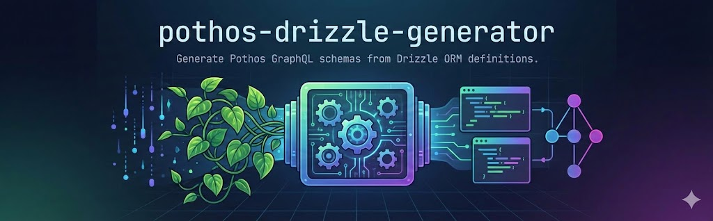

# Pothos Drizzle Generator

**Pothos Drizzle Generator** is a robust Pothos plugin designed to automatically generate a complete GraphQL schema (Queries & Mutations) directly from your Drizzle ORM schema definitions.

By automating the creation of types, input objects, and resolvers for standard CRUD operations, this tool significantly reduces boilerplate code. It also provides granular control over permissions, complex filtering, and field visibility, ensuring your API remains secure and performant.

- Screenshot in ApolloExplorer

## 🚀 Key Features

- **Automated CRUD Generation**: Instantly generates `findMany`, `findFirst`, `create`, `update`, and `delete` operations.
- **End-to-End Type Safety**: Ensures fully typed inputs and outputs that stay in sync with your Drizzle schema.
- **Deep Relational Filtering**: Apply filters, sorting, and pagination **not just to the main resource, but also to any nested relations** (e.g., "Find users and their _published_ posts").
- **Advanced Filtering**: Built-in support for complex queries, including `AND`, `OR`, `gt` (greater than), `contains`, and more.
- **Granular Access Control**: Configure visibility and permissions globally or on a per-model basis.
- **Smart Relations**: Seamlessly handles join tables and nested relationships.
- **Supported Databases**: PostgreSQL, SQLite.

## 🔗 Sample Repository

Explore a working implementation in the sample repository:
[https://github.com/SoraKumo001/pothos-drizzle-generator-sample](https://github.com/SoraKumo001/pothos-drizzle-generator-sample)

---

## 📚 Documentation

For detailed instructions and examples, please refer to the following guides:

- **[Getting Started](./documents/getting-started.md)**
  - Requirements
  - Installation
  - Quick Start Guide
- **[Configuration Guide](./documents/configuration.md)**
  - Table Selection
  - Global Defaults & Model Overrides
  - API Reference
  - Comprehensive Example
- **[Capabilities & Features](./documents/capabilities.md)**
  - Optimized Data Retrieval (Solving N+1)
  - Transactional Mutations
  - Supported Features Checklist

## License

MIT
