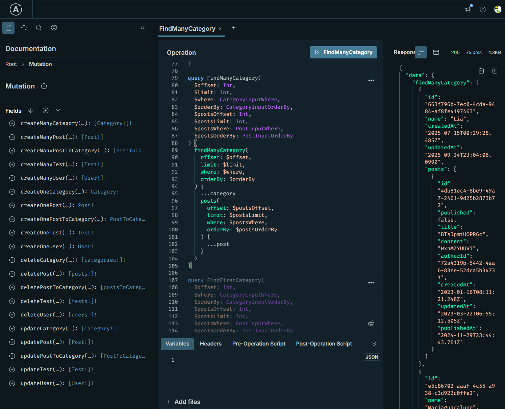

# pothos-drizzle-generator

A Pothos plugin that automatically generates GraphQL schemas based on Drizzle schema information.

Currently under development, so the test program will run.



# How to run the program

- Initialization

```sh
pnpm run dev:docker
pnpm run drizzle:migrate
pnpm run drizzle:seed
```

- Execution

```sh
pnpm run dev
```

# Current implementation status

## Operations

- findMany
- findFirst
- count
- create
- update
- delete

## Parameters

- where
- orderBy
- offset
- limit

## operators

- AND
- OR
- NOT
- eq
- ne
- gt
- gte
- lt
- lte
- like
- notLike
- ilike
- notIlike
- isNull
- isNotNull,
- in,
- notIn
- arrayContained
- arrayOverlaps
- arrayContains
